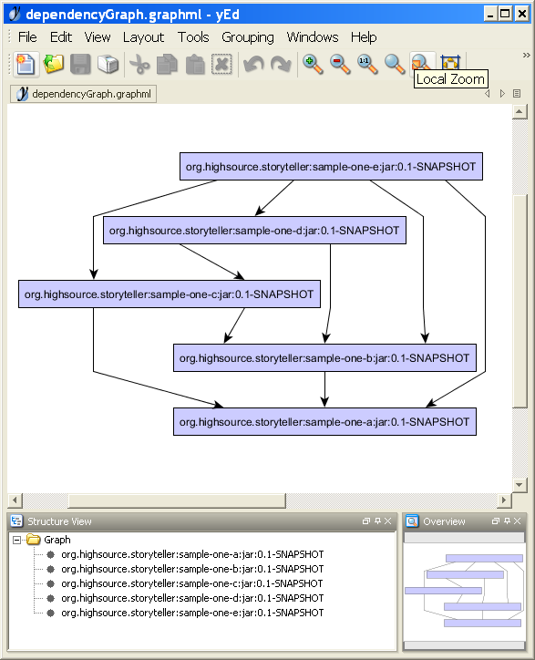

# Storyteller Maven Plugin

In one sentence, Storyteller Maven Plugin helps you to understand, analyze and clean up dependencies of your Maven project. Features:

* Build full dependency graph of your Maven project and export it in GML, DOT, PDF, PNG and other formats.
* Find out unnecessary dependency declarations.
* Perform in-depth bytecode analysis and detect dependencies which are not really used.

# Introduction

Maven does really a great job managing dependencies of your project. You just
need to declare what you project depends on - and let Maven download the
directly or transitively referenced artifacts, include them into build or test
classpath and so on.

However, when working with large projects, you often end up with a huge runtime
classpath - and you start asking yourself "Does my project really need all
these JARs? If not, where do I have to tweak?".

This project provides a set of tools which can help to answer these questions.
The core component, Storyteller Maven Plugin implements a number of utilities
which can analyze dependencies of your project, export the dependency graph in
a comprehensive format check which artifacts are "really" needed, and give
accurate recommendations for improvements.

# Typical problems with dependencies

## Unnecessarily declared dependencies

## Unneeded dependencies

## Wrong declaration scope

# Solutions for typical problems

## Remove unnecessary dependency declarations

## Remove unneeded dependencies

## Exclude dependencies from third-party artifacts

## Correct declaration scope

# Building and analyzing dependency graph of your project with Maven Storyteller Plugin

## Overview

## Dependency graph versus dependency tree

Many of the Maven users are probably familiar with the
[`tree`](http://maven.apache.org/plugins/maven-dependency-plugin/tree-mojo.html)
goal of the [Maven Dependency Plugin](http://maven.apache.org/plugins/maven-dependency-plugin).
This goal displays the dependency tree of the project and is quite helpful when
analysing dependencies of your project.

However, when we take a closer look, the real structure of the project
dependencies is not a tree. It is a directed graph. When resolving dependencies,
Maven simplifies this graph (for instance replaces more "distant" dependencies
with "nearer") and turns it into into a tree. But the true nature of dependencies
is still a directed graph. Using a tree rather than a graph for dependency analysis
means using a much poorer structure.  
To illustrate this, let's consider the following dependency graph:


You can easily see that artifacts in this graph have many redundant
dependencies. But if you consider the dependency *tree* produced by
the dependency plugin, you won't see these problems:


For these reasons Storyteller uses dependency graph for dependency analysis.

## Using Storyteller

### Invoking Storyteller from the command line

Below is the typical command line invocation of the Maven Storyteller Plugin:

```
mvn verify
    org.hisrc.storyteller:storyteller-maven-plugin:export-dependency-graph
    -Dfile=dependencyGraph.png
```

In this case we execute the `export-dependency-graph` goal of the plugin.
Since most of the Storyteller goals are intended to be executed in the
`verify` phase, it is recommended to run Storyteller with `mvn verify`.

If you use Storyteller often, it would make sense to add
the `org.hisrc.storyteller` group to plugin groups in `settings.xml` of
your Maven:

```
<settings ...>
  ...
  <pluginGroups>
    ...
    <pluginGroup>org.hisrc.storyteller</pluginGroup>
  </pluginGroups>
  ...
</settings>
```

This will allow you to use the `storyteller` prefix when invoking the plugin
which makes invocation a bit more laconic:

```
mvn verify storyteller:export-dependency-graph -Dfile=dependencyGraph.png
```

## Exporting dependency graph

The very first step in diagnostics of dependency problems is to understand the
dependency structure. To help you with this task, Storyteller implements goals
which can display or export the dependency graph in various formats.

### Displaying dependency graph

Storyteller provides the `export-dependency-graph` goal which outputs the
dependency graph into the console. Below is the invocation example:

```
mvn org.hisrc.storyteller:storyteller-maven-plugin:export-dependency-graph
```

Prefixed invocation syntax:

```
mvn storyteller:export-dependency-graph
```

Result:

```
[INFO] ------------------------------------------------------------------------
[INFO] Building Maven Storyteller Plugin - Sample One [e]
[INFO]    task-segment: [org.hisrc.storyteller:storyteller-maven-plugin:display-dependency-graph]
[INFO] ------------------------------------------------------------------------
[INFO] [storyteller:display-dependency-graph {execution: default-cli}]
[INFO] \- org.hisrc.storyteller:sample-one-e:jar:0.1-SNAPSHOT
[INFO]    +- org.hisrc.storyteller:sample-one-b:jar:0.1-SNAPSHOT
[INFO]    |  \- org.hisrc.storyteller:sample-one-a:jar:0.1-SNAPSHOT
[INFO]    +- org.hisrc.storyteller:sample-one-d:jar:0.1-SNAPSHOT
[INFO]    |  +- org.hisrc.storyteller:sample-one-b:jar:0.1-SNAPSHOT
[INFO]    |  |  \- org.hisrc.storyteller:sample-one-a:jar:0.1-SNAPSHOT
[INFO]    |  \- org.hisrc.storyteller:sample-one-c:jar:0.1-SNAPSHOT
[INFO]    |     +- org.hisrc.storyteller:sample-one-b:jar:0.1-SNAPSHOT
[INFO]    |     |  \- org.hisrc.storyteller:sample-one-a:jar:0.1-SNAPSHOT
[INFO]    |     \- org.hisrc.storyteller:sample-one-a:jar:0.1-SNAPSHOT
[INFO]    +- org.hisrc.storyteller:sample-one-a:jar:0.1-SNAPSHOT
[INFO]    \- org.hisrc.storyteller:sample-one-c:jar:0.1-SNAPSHOT
[INFO]       +- org.hisrc.storyteller:sample-one-b:jar:0.1-SNAPSHOT
[INFO]       |  \- org.hisrc.storyteller:sample-one-a:jar:0.1-SNAPSHOT
[INFO]       \- org.hisrc.storyteller:sample-one-a:jar:0.1-SNAPSHOT
[INFO] ------------------------------------------------------------------------
[INFO] BUILD SUCCESSFUL
[INFO] ------------------------------------------------------------------------
```

Compare this to the `dependency:tree`:

```
[INFO] ------------------------------------------------------------------------
[INFO] Building Maven Storyteller Plugin - Sample One [e]
[INFO]    task-segment: [dependency:tree]
[INFO] ------------------------------------------------------------------------
[INFO] [dependency:tree {execution: default-cli}]
[INFO] org.hisrc.storyteller:sample-one-e:jar:0.1-SNAPSHOT
[INFO] +- org.hisrc.storyteller:sample-one-a:jar:0.1-SNAPSHOT:compile
[INFO] +- org.hisrc.storyteller:sample-one-b:jar:0.1-SNAPSHOT:compile
[INFO] +- org.hisrc.storyteller:sample-one-c:jar:0.1-SNAPSHOT:compile
[INFO] +- org.hisrc.storyteller:sample-one-d:jar:0.1-SNAPSHOT:compile
[INFO] \- junit:junit:jar:4.8.1:test
[INFO] ------------------------------------------------------------------------
[INFO] BUILD SUCCESSFUL
[INFO] ------------------------------------------------------------------------
```

You can also display the dependency graph for a third-party project:

```
mvn storyteller:display-dependency-graph
    -DgroupId=org.hibernate -DartifactId=hibernate-core -Dversion=3.3.2.GA
```

If you need to specify a certain remote repository, use the `repositoryURL`
switch:

```
mvn storyteller:display-dependency-graph
    -DgroupId=org.hibernate -DartifactId=hibernate-core -Dversion=3.3.2.GA
    -DrepositoryURL=http://repository.jboss.com/maven2
```

### Exporting dependency graph into a file

Storyteller provides a further `export-dependency-graph` goal which can export
the dependency graph into a target file in different formats:

```
mvn clean verify
    org.hisrc.storyteller:storyteller-maven-plugin:export-dependency-graph
    -Dfile=dependencyGraph.png
```

Export format is determined by the extension of the target file. Currently the
following formats are supporterd:

* `dot`
* `gml`
* `graphml`
* `pdf`
* `png`

Just like with the `display-dependency-graph` goal, you can export the
dependency graph for any third-party project:

```
mvn storyteller:export-dependency-graph
    -Dfile=hibernate-entitymanager.png
    -DgroupId=org.hibernate
    -DartifactId=hibernate-entitymanager
    -Dversion=3.4.0.GA
    -DrepositoryURL=http://repository.jboss.com/maven2
```

In order to export dependency graph in graphical formats like `png` or `pdf`,
you will need to install and configure GraphViz (see below).

#### Installing and configuring GraphViz

In order to render the dependency graph in visual formats like PNG or PDF,
Storyteller uses [GraphViz](http://www.graphviz.org/) the popular open-source
graph visualization tool. [GraphViz](http://www.graphviz.org/) is not embedded
in Storyteller, you will need to install it on your own. Here's how:

* Download and install [GraphViz](http://www.graphviz.org/).
* Storyteller uses the `graphViz.dotFile` property to access the GraphViz `dot`
executable. Below are the options to configure this property.
* Create the GraphViz profile in your Maven's `settings.xml`:  
```
<settings ...>
  ...
  <profiles>
    ...
    <profile>
      <id>graphviz.org</id>
      <properties>
        <!-- Absolute path of the GraphViz dot executable -->
        <graphViz.dotFile>C:\Programme\Graphviz2.24\bin\dot.exe</graphViz.dotFile>
      </properties>
    </profile>
  </profiles>
  ...
  <activeProfiles>
    ...
    <activeProfile>graphviz.org</activeProfile>
  </activeProfiles>
</settings>
```
* Alternatively, you can specify the location of `dot` when you invoke Storyteller:  
```
mvn clean verify
    org.hisrc.storyteller:storyteller-maven-plugin:export-dependency-graph
    -Dfile=dependencyGraph.png
    -DgraphViz.dotFile=C:\Programme\Graphviz2.24\bin\dot.exe
```
#### Using yEd to analyze or edit your dependency graph

If you have really complex dependency graphs, static visualization (like in PNG
or PDF) will probably not be enough. You may want to manipulate this graph -
edit it, layout in different ways, group nodes and so one.

One of the tools I have found very helpful for such tasks is
[yEd](http://www.yworks.com/products/yed/).
[yEd](http://www.yworks.com/products/yed/) is an extremely powerful graph
editor which provides great number of useful features including automatic
layouting, grouping of nodes and, of course, graph editing. yEd also reads many
of the popular graph formats.

If you want to import your graph into yEd, make the following steps:

* Export your dependency graph in GML format:
```
mvn clean verify
    org.hisrc.storyteller:storyteller-maven-plugin:export-dependency-graph
    -Dfile=dependencyGraph.gml
```

* Open the generated graph file in yEd.
* Adjust nodes to fit labels (Tools > Fit Node to Label...)
* Layout graph (ex. Layout > Hierarchical > Classic...)

Here's a snapshot of dependency graph which was exported by the Storyteller and imported into yEd:



## Finding out redundant declared dependencies

## Finding out unused dependencies

